# Phase 6: Generated File Workflow - Flow Diagram

This document illustrates the complete workflow for generating a file using SwiftHablare, from request initiation through display.

## Overview

The workflow demonstrates:
1. Request initiation by a parent element
2. Request ID assignment by the broker
3. Background API processing
4. File storage in TextPack (.guion) bundles
5. SwiftData persistence
6. Display view retrieval and rendering

---

## Complete Workflow Diagram

```mermaid
graph TB
    subgraph Entities["Core Entities"]
        Parent["Parent Element
        ━━━━━━━━━━━━━
        SwiftData Model
        Initiates generation
        Stores requestID
        Displays results"]

        Child["Generated File Record
        ━━━━━━━━━━━━━━━━━━
        AIGeneratedContent Model
        TypedDataFileReference
        Metadata & status
        Links to Parent"]

        File["Physical File
        ━━━━━━━━━━━━
        .guion Bundle
        Requests/{requestID}.guion/
        Resources/{UUID}.ext
        Binary/JSON/Text data"]
    end

    subgraph Actors["System Actors"]
        Broker["TypedDataBroker
        Actor"]
        ReqMgr["AIRequestManager
        Actor"]
        Provider["AI Provider
        Background"]
        Coordinator["TextPackCoordinator
        Actor"]
        DataCoord["AIDataCoordinator
        Main Actor"]
    end

    Parent -->|1. requestFile| Broker
    Broker -->|2. generate requestID| Broker
    Broker -->|3. create storage area| Coordinator
    Coordinator -->|4. create bundle| File
    Broker -->|5. submit request| ReqMgr
    ReqMgr -->|6. execute with storageArea| Provider
    Provider -->|7. API call returns data| Provider
    Provider -->|8. write large data| Coordinator
    Coordinator -->|9. write to| File
    File -->|10. return fileReference| Coordinator
    Coordinator -->|11. fileReference| ReqMgr
    ReqMgr -->|12. create response| Child
    Child -->|13. links to| File
    ReqMgr -->|14. response with fileRef| Broker
    Broker -->|15. merge response| DataCoord
    DataCoord -->|16. persist| Child
    Child -->|17. associates with| Parent
    Broker -->|18. notify completion| Parent

    Parent -.->|19. request display| Broker
    Broker -.->|20. get view| Provider
    Provider -.->|21. read if needed| Coordinator
    Coordinator -.->|22. read from| File
    File -.->|23. return data| Provider
    Provider -.->|24. create SwiftUI view| Provider
    Provider -.->|25. return view| Parent

    style Parent fill:#e1f5ff,stroke:#0066cc,stroke-width:3px
    style Child fill:#ffe1f5,stroke:#cc0066,stroke-width:3px
    style File fill:#f0ffe1,stroke:#00cc66,stroke-width:3px
    style Broker fill:#fff4e1,stroke:#cc9900,stroke-width:2px
    style ReqMgr fill:#fff4e1,stroke:#cc9900,stroke-width:2px
    style Provider fill:#ffe1e1,stroke:#cc3300,stroke-width:2px
    style Coordinator fill:#fff4e1,stroke:#cc9900,stroke-width:2px
    style DataCoord fill:#e1f5ff,stroke:#0066cc,stroke-width:2px
```



---

## Component Details

### 1. Parent Element (Main Thread)
- **Role**: Initiates file generation requests, stores request IDs, displays results
- **Examples**: Document editor, content generator, multi-media creator
- **Thread**: Main Actor
- **Key Operations**:
  - Requests file generation from broker
  - Stores requestID for tracking
  - Requests display view when ready

### 2. TypedDataBroker (Actor - Proposed)
- **Role**: Central coordinator for typed data requests and responses
- **Thread**: Actor (isolated)
- **Responsibilities**:
  - Assigns request IDs (UUID)
  - **Creates request-specific storage areas** (on init)
  - Maintains requestID → parentID mappings
  - Maintains requestID → storageArea mappings
  - Coordinates between request manager and data coordinator
  - Manages request lifecycle
  - Provides status updates to parent elements
- **New Component**: To be implemented in Phase 6
- **Initialization**:
  - On broker init, establishes base storage directory
  - Creates `Requests/` directory for request-specific bundles
  - Each request gets isolated `.guion` bundle at `Requests/{requestID}.guion`

### 3. AIRequestManager (Actor - Existing)
- **Role**: Manages request execution lifecycle
- **Thread**: Actor (isolated)
- **Location**: `Sources/SwiftHablare/Request/AIRequestManager.swift`
- **Key Features**:
  - Submits requests to providers
  - Executes in background tasks
  - Tracks request status (pending → executing → completed)
  - Stores AIResponseData
  - Supports cancellation and batch operations

### 4. AI Provider (Background)
- **Role**: Executes API calls to remote AI services
- **Thread**: Background Task
- **Protocol**: `AIServiceProvider`
- **Location**: `Sources/SwiftHablare/Core/AIServiceProvider.swift`
- **Key Operations**:
  - `generate(prompt, parameters)` → Returns `ResponseContent`
  - `makeTypedDataView(fileReference)` → Returns SwiftUI View (proposed)
  - Returns Sendable response types

### 5. TextPackCoordinator (Actor - Proposed)
- **Role**: Thread-safe file operations for .guion bundles
- **Thread**: Actor (isolated)
- **Integration**: Uses SwiftGuion library
- **Responsibilities**:
  - **Creates request-specific storage areas** (per-request .guion bundles)
  - Opens/closes .guion bundles
  - Writes resources with UUID-based naming to request-specific bundles
  - Reads resources by file reference
  - Manages concurrent bundle access
  - Initializes bundle structure (info.json, Resources/ directory)
- **New Component**: To be implemented in Phase 6
- **Storage Organization**:
  ```
  Base Storage Directory/
  └── Requests/
      ├── {requestID-1}.guion/
      │   ├── info.json
      │   └── Resources/
      │       ├── {fileUUID-1}.png
      │       └── {fileUUID-2}.json
      └── {requestID-2}.guion/
          ├── info.json
          └── Resources/
              └── {fileUUID-3}.mp3
  ```

### 6. AIDataCoordinator (Main Actor - Existing)
- **Role**: Merges AI responses into SwiftData models
- **Thread**: Main Actor
- **Location**: `Sources/SwiftHablare/Core/AIDataCoordinator.swift`
- **Key Features**:
  - Receives AIResponseData from background
  - Updates SwiftData models on main thread
  - Validates and transforms response content
  - Provides completion callbacks

### 7. SwiftData Context (Main Thread)
- **Role**: Persists model data
- **Thread**: Main Actor
- **Models**: Based on `AIGeneratedContent`
- **Location**: `Sources/SwiftHablare/Models/AIGeneratedContent.swift`
- **Storage**:
  - File references (TypedDataFileReference)
  - Request metadata
  - Parent element relationships

### 8. .guion Bundle Storage (File System)
- **Role**: Persistent file storage
- **Format**: TextPack (.guion) bundles
- **Library**: SwiftGuion (https://github.com/intrusive-memory/SwiftGuion)
- **Organization**: Request-specific bundles at `Requests/{requestID}.guion/`
- **File Naming**: `Resources/{UUID}.{extension}` within each bundle
- **Access**: Through TextPackCoordinator actor only
- **Bundle Structure**:
  - `info.json`: Bundle metadata (request ID, creation date, provider ID)
  - `Resources/`: Directory containing all generated files for this request
- **Isolation**: Each request has its own isolated storage area
- **Cleanup**: Request bundles can be deleted independently when request completes

---

## Data Types & Structures

### StorageAreaReference (Proposed)
```swift
struct StorageAreaReference: Codable, Sendable {
    let requestID: UUID          // Associated request ID
    let bundleURL: URL           // Path to request-specific .guion bundle
    let createdAt: Date          // When storage area was created

    // Computed path to Resources directory
    var resourcesDirectory: URL {
        bundleURL.appendingPathComponent("Resources")
    }
}
```

### TypedDataFileReference (Proposed)
```swift
struct TypedDataFileReference: Codable, Sendable {
    let uniqueID: UUID           // Unique identifier for file
    let requestID: UUID          // Associated request ID
    let bundlePath: URL          // Path to .guion bundle (request-specific)
    let relativePath: String     // Relative path within bundle: "Resources/{UUID}.{ext}"
    let contentType: String      // MIME type
    let sizeBytes: Int64         // File size
    let createdAt: Date          // Creation timestamp

    // Full path to file
    var fullPath: URL {
        bundlePath.appendingPathComponent(relativePath)
    }
}
```

### AIResponseData (Existing)
```swift
struct AIResponseData: Sendable {
    let requestID: UUID
    let providerID: String
    let content: ResponseContent    // Contains typed data or file reference
    let metadata: [String: String]
    let receivedAt: Date
    var error: AIServiceError?
}
```

### ResponseContent (Existing)
```swift
enum ResponseContent: Sendable {
    case text(String)
    case data(Data)
    case audio(Data, format: String)
    case image(Data, format: String)
    case structured([String: SendableValue])
}
```

---

## Broker Initialization & Storage Management

### TypedDataBroker Initialization
```swift
actor TypedDataBroker {
    private let baseStorageURL: URL
    private let textPackCoordinator: TextPackCoordinator
    private var storageAreas: [UUID: StorageAreaReference] = [:]

    init(baseStorageURL: URL) async throws {
        self.baseStorageURL = baseStorageURL
        self.textPackCoordinator = TextPackCoordinator()

        // Create base storage structure
        let requestsDirectory = baseStorageURL.appendingPathComponent("Requests")
        try FileManager.default.createDirectory(
            at: requestsDirectory,
            withIntermediateDirectories: true
        )
    }

    func createStorageArea(for requestID: UUID) async throws -> StorageAreaReference {
        let bundleURL = baseStorageURL
            .appendingPathComponent("Requests")
            .appendingPathComponent("\(requestID.uuidString).guion")

        // Create bundle through coordinator
        let storageArea = try await textPackCoordinator.createRequestBundle(
            at: bundleURL,
            requestID: requestID
        )

        // Store mapping
        storageAreas[requestID] = storageArea

        return storageArea
    }
}
```

### Storage Area Lifecycle
1. **Creation**: When request is initiated
   - Broker generates request ID
   - Broker asks TextPackCoordinator to create bundle
   - Bundle created at `Requests/{requestID}.guion/`
   - StorageAreaReference returned and mapped

2. **Usage**: During request execution
   - Provider receives storage area reference
   - Provider can write files via TextPackCoordinator
   - All files isolated to request's bundle

3. **Persistence**: After request completion
   - File references stored in SwiftData
   - Bundle persists on disk
   - Can be accessed later for display

4. **Cleanup** (optional): When request data no longer needed
   - Broker can delete bundle via TextPackCoordinator
   - All request files removed atomically
   - SwiftData maintains metadata about deleted files

### Benefits of Request-Specific Storage
- **Isolation**: Each request's files are separate and independent
- **Atomic Cleanup**: Delete entire request's data with single operation
- **Organization**: Easy to navigate and debug file structure
- **Security**: No file name collisions between requests
- **Portability**: Each .guion bundle is self-contained and shareable
- **Provider Control**: Provider writes to its own isolated area without conflicts

---

## Request Flow States

### Request Lifecycle
1. **Pending**: Request submitted, waiting for execution
2. **Executing**: Provider making API call
3. **Processing**: File write in progress (if large data)
4. **Persisting**: SwiftData merge in progress
5. **Completed**: Ready for display
6. **Failed**: Error occurred (with AIServiceError)

### Status Observation
```swift
// Parent can observe request status
for await status in broker.statusStream(for: requestID) {
    switch status {
    case .pending:
        showLoadingIndicator()
    case .executing:
        updateProgress()
    case .completed(let response):
        requestDisplayView(response)
    case .failed(let error):
        showError(error)
    }
}
```

---

## Thread Safety Guarantees

### Actor Isolation
- **TypedDataBroker**: Actor-isolated, thread-safe request coordination
- **AIRequestManager**: Actor-isolated, manages background execution
- **TextPackCoordinator**: Actor-isolated, serializes file I/O
- **AIDataCoordinator**: Main-actor-isolated, safe SwiftData access

### Sendable Types
- All data crossing actor boundaries is `Sendable`:
  - `AIRequest`, `AIResponseData`, `ResponseContent`
  - `TypedDataFileReference`
  - Provider responses

### Zero Race Conditions
- SwiftData operations only on main thread (AIDataCoordinator)
- Background providers never touch ModelContext
- File operations serialized through TextPackCoordinator
- Request state managed by single actor (AIRequestManager)

---

## Display Flow (Three-View Pattern)

### Provider View Creation (Proposed)
```swift
protocol AIRequestor {
    // Creates view for displaying typed data
    func makeListItemView(data: TypedData) -> some View
    func makeDetailView(data: TypedData) -> some View
    func makeCombinedView(items: [TypedData]) -> some View
}
```

### View Retrieval Process
1. Parent requests view from broker
2. Broker delegates to provider's `makeTypedDataView`
3. Provider reads file (if needed) via TextPackCoordinator
4. Provider parses typed data
5. Provider returns SwiftUI view
6. Parent embeds view in hierarchy

### Example Views by Type
- **Audio**: Waveform + play controls + metadata
- **Image**: Thumbnail + zoom controls + properties
- **Text**: Formatted display + word count + styling
- **Video**: Player + timeline + quality selector

---

## Performance Considerations

### Data Size Thresholds (To Be Measured)
Per Phase 6 Pre-Implementation Checklist:
- Measure performance for: 1KB, 10KB, 100KB, 1MB, 10MB, 100MB
- Record metrics for in-memory vs file-based storage
- Defer threshold decisions until after data collection

### Current Strategy
- **Small data** (exact threshold TBD): Store inline in ResponseContent
- **Large data** (exact threshold TBD): Store in .guion bundle files
- All data can be accessed through same interface regardless of storage method

### File Storage Benefits
- Prevents main thread blocking
- Supports streaming/chunked access
- Enables efficient memory management
- Allows external tool access (.guion is standard TextBundle format)

---

## Error Handling

### Error Types (Proposed in Checklist)
```swift
enum TypedDataError: Error, LocalizedError {
    case missingRequiredField(fieldName: String, expectedType: String)
    case typeMismatch(fieldName: String, expected: String, received: String)
    case validationFailed(fieldName: String, reason: String)
    case schemaViolation(description: String, path: String)
    case fileTooLarge(sizeBytes: Int64, fileName: String)
    case fileAccessFailed(fileID: UUID, reason: String)
    case bundleCorrupted(bundlePath: URL, reason: String)
}
```

### Error Propagation
1. Provider errors → AIServiceError in ResponseContent
2. File I/O errors → TypedDataError from TextPackCoordinator
3. Validation errors → TypedDataError in AIDataCoordinator
4. All errors propagate to parent via status updates

---

## Integration with Existing Architecture

### Leverages Phase 0-5 Components
- ✅ **AIServiceProvider**: Base provider protocol
- ✅ **AIRequestManager**: Request lifecycle management
- ✅ **AIDataCoordinator**: SwiftData integration
- ✅ **AIGeneratedContent**: Model base classes
- ✅ **Concurrency Architecture**: Actor-based design
- ✅ **Security Layer**: Credential management

### New Phase 6 Components
- 🆕 **TypedDataBroker**: Central typed data coordinator
- 🆕 **TextPackCoordinator**: File storage manager
- 🆕 **TypedDataFileReference**: File reference structure
- 🆕 **Provider View Methods**: Display view creation
- 🆕 **Three-View Pattern**: List/Detail/Combined views

---

## Future Enhancements (Post-Phase 6)

### Schema Validation
- JSON Schema support for structured data
- Type-safe data extraction with Codable
- Custom validation rules per provider

### Streaming Support
- Large file streaming during generation
- Progress callbacks during download
- Incremental display updates

### Caching Layer
- Cache typed data views for faster display
- LRU eviction for memory management
- Disk cache for file-based storage

---

## References

- **Phase 6 Pre-Implementation Checklist**: `/Docs/PHASE_6_PRE_IMPLEMENTATION_CHECKLIST.md`
- **SwiftGuion Library**: https://github.com/intrusive-memory/SwiftGuion
- **AIRequestManager**: `/Sources/SwiftHablare/Request/AIRequestManager.swift`
- **AIDataCoordinator**: `/Sources/SwiftHablare/Core/AIDataCoordinator.swift`
- **AIServiceProvider**: `/Sources/SwiftHablare/Core/AIServiceProvider.swift`
- **AIGeneratedContent**: `/Sources/SwiftHablare/Models/AIGeneratedContent.swift`

---

**Document Version**: 1.0
**Created**: 2025-10-12
**Status**: Design Document
**Next Steps**: Implement TypedDataBroker and TextPackCoordinator based on this flow
