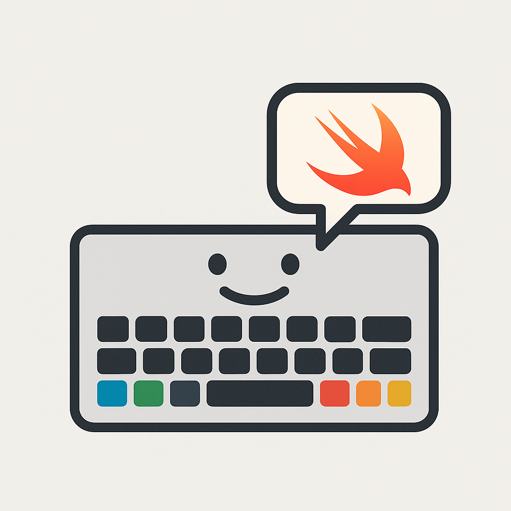

<div align="center">
  
</div>

# SwiftHablaré

A Swift package for text-to-speech audio generation with support for multiple TTS providers, including Apple's built-in TTS and ElevenLabs.

## Features

- **Multiple Provider Support**: Easily switch between Apple TTS and ElevenLabs
- **SwiftData Integration**: Built-in caching for voices and generated audio
- **Secure API Key Storage**: Uses Keychain for secure credential management
- **Async/Await API**: Modern Swift concurrency support
- **Audio File Management**: Generate, cache, and write audio files with ease

## Requirements

- macOS 14.0+ / iOS 17.0+
- Swift 6.0+
- SwiftData

## Installation

### Swift Package Manager

Add SwiftHablaré to your project using Swift Package Manager:

```swift
dependencies: [
    .package(url: "path/to/SwiftHablare", from: "1.0.0")
]
```

## Usage

### Basic Setup

```swift
import SwiftHablare
import SwiftData

// Initialize with a ModelContext
let manager = VoiceProviderManager(modelContext: modelContext)
```

### Fetching Available Voices

```swift
// Get voices from the current provider
let voices = try await manager.getVoices()

// Force refresh from the provider (bypass cache)
let freshVoices = try await manager.getVoices(forceRefresh: true)
```

### Switching Providers

```swift
// Switch to Apple TTS
manager.switchProvider(to: .apple)

// Switch to ElevenLabs
manager.switchProvider(to: .elevenlabs)

// Check if current provider is configured
if manager.isCurrentProviderConfigured() {
    // Provider is ready to use
}
```

### Generating and Caching Audio

```swift
// Generate audio and cache it in SwiftData
let audioFile = try await manager.generateAndCacheAudio(
    text: "Hello, world!",
    voiceId: "voice-id-here",
    providerId: "elevenlabs",
    audioFormat: "mp3"
)

// The audioFile contains:
// - Binary audio data
// - Duration estimate
// - Voice and provider information
// - Creation timestamp
```

### Writing Audio to File

```swift
let outputURL = URL(fileURLWithPath: "/path/to/output.mp3")
try manager.writeAudioFile(audioFile, to: outputURL)
```

### Working with Individual Providers

```swift
// Get a specific provider
if let provider = manager.getProvider(for: "elevenlabs") {
    // Check if it's configured
    if provider.isConfigured() {
        // Generate audio directly
        let audioData = try await provider.generateAudio(
            text: "Hello!",
            voiceId: "voice-id"
        )
    }
}
```

### API Key Management (ElevenLabs)

```swift
import SwiftHablare

// Save API key
let keychain = KeychainManager.shared
try keychain.saveAPIKey("your-api-key", for: "elevenlabs-api-key")

// Retrieve API key
let apiKey = try keychain.getAPIKey(for: "elevenlabs-api-key")

// Check if API key exists
if keychain.hasAPIKey(for: "elevenlabs-api-key") {
    // API key is configured
}

// Delete API key
try keychain.deleteAPIKey(for: "elevenlabs-api-key")
```

## SwiftData Models

### AudioFile

Stores generated audio with metadata:

```swift
@Model
public final class AudioFile {
    public var id: UUID
    public var text: String
    public var voiceId: String
    public var providerId: String
    public var audioData: Data
    public var audioFormat: String
    public var duration: TimeInterval?
    public var sampleRate: Int?
    public var bitRate: Int?
    public var channels: Int?
    public var createdAt: Date
    public var modifiedAt: Date
}
```

### VoiceModel

Caches voice information from providers:

```swift
@Model
public final class VoiceModel {
    public var voiceId: String
    public var name: String
    public var voiceDescription: String?
    public var providerId: String
    public var language: String?
    public var locality: String?
    public var gender: String?
    public var lastFetched: Date
}
```

## Providers

### Apple Voice Provider

- **Provider ID**: `apple`
- **Requires API Key**: No
- **Platform**: macOS, iOS
- **Features**: Built-in system voices, no API key required

### ElevenLabs Voice Provider

- **Provider ID**: `elevenlabs`
- **Requires API Key**: Yes
- **Platform**: Cross-platform (requires internet)
- **Features**: High-quality AI voices, multiple languages

## Architecture

SwiftHablaré is designed around the `VoiceProvider` protocol, allowing easy extensibility:

```swift
public protocol VoiceProvider: Sendable {
    var providerId: String { get }
    var displayName: String { get }
    var requiresAPIKey: Bool { get }

    func isConfigured() -> Bool
    func fetchVoices() async throws -> [Voice]
    func generateAudio(text: String, voiceId: String) async throws -> Data
    func estimateDuration(text: String, voiceId: String) async -> TimeInterval
    func isVoiceAvailable(voiceId: String) async -> Bool
}
```

To add a new provider, simply implement this protocol and register it with the `VoiceProviderManager`.

## Error Handling

```swift
do {
    let audioFile = try await manager.generateAndCacheAudio(
        text: "Test",
        voiceId: "voice-id",
        providerId: "elevenlabs"
    )
} catch VoiceProviderError.notConfigured {
    // Provider needs configuration (API key, etc.)
} catch VoiceProviderError.networkError(let message) {
    // Network error occurred
    print("Error: \(message)")
} catch {
    // Other errors
    print("Unexpected error: \(error)")
}
```

## License

This package is part of the TableReader project.

## Contributing

Contributions are welcome! Please ensure all tests pass before submitting a pull request.
